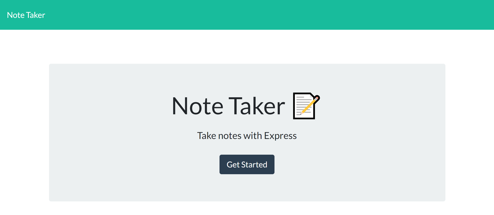
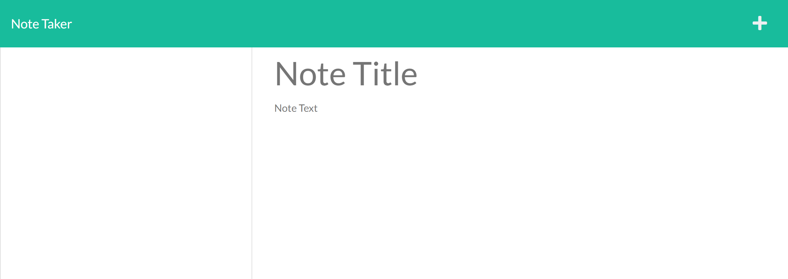

# Note-Taker-Application

## License

    This project is licensed with MIT.

## Description

This application is uzed to write and save notes. The user can enter notes they would like to save which features dynamically updated HTML and CSS. The application uses an Express.js back end and will save and retrieve note data from a JSON file.

## Table of Contents

1. [License](#license)
2. [Installation](#installation)
3. [Usage](#usage)
4. [Tests](#tests)
5. [Contributing](#contributing)
6. [Questions](#questions)

## Installation

npm i

## Usage

This project will be used to take and save notes. The user should take the following steps: Run node server.js in their terminal to ensure the local host is listening, go to localhost: 3001, click the start button to bring up the note page, and type in and save notes.

## Tests

npm run test

## Contributing

## Questions

Questions?

You may reach me by email at: <eaim928@gmail.com>

You may also reach me on github: <https://github.com/gim928>

This application is deployed at: https://infinite-lake-73740.herokuapp.com/
and at: https://gim928.github.io/Note-Taker-App/

Screenshots: 

